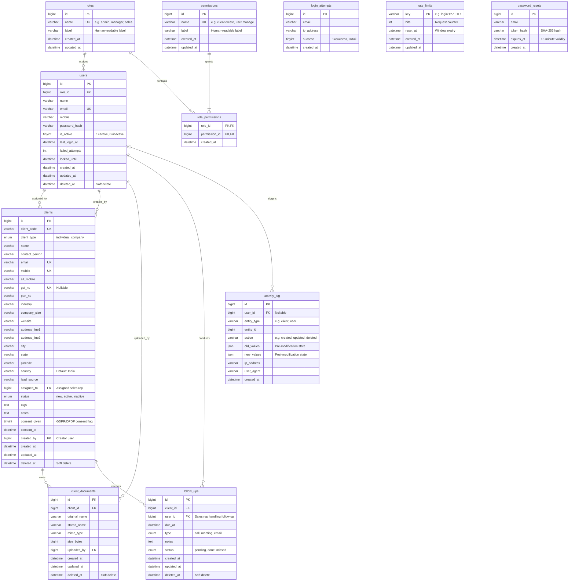

# CRM Portal — Entity Relationship (ER) Diagram & Database Architecture

## Overview

The database is built on **MySQL 8 (InnoDB)** using the `utf8mb4_unicode_ci` collation. It provides:
- Role-Based Access Control (RBAC) via `roles`, `permissions`, and `role_permissions`.
- Client and Document management with audit tracking and soft-deletes (`deleted_at`).
- Sales workflow tracking through scheduled `follow_ups`.
- Security and audit log enforcement through `activity_log`, `login_attempts`, and IP/Route-level `rate_limits`.

---

## Mermaid ER Diagram



---

## Table Summary & Indexes

| Table | Soft Delete (`deleted_at`) | Indexes & Constraints |
| :--- | :--- | :--- |
| `roles` | No | `PRIMARY KEY (id)`, `UNIQUE (name)` |
| `permissions` | No | `PRIMARY KEY (id)`, `UNIQUE (name)` |
| `role_permissions` | No | `PRIMARY KEY (role_id, permission_id)`, `FK (role_id)`, `FK (permission_id)` |
| `users` | Yes | `PRIMARY KEY (id)`, `UNIQUE (email)`, `INDEX (role_id)`, `INDEX (deleted_at)` |
| `clients` | Yes | `PRIMARY KEY (id)`, `UNIQUE (client_code)`, `UNIQUE (email)`, `UNIQUE (mobile)`, `UNIQUE (gst_no)`, `INDEX (status)`, `INDEX (assigned_to)`, `INDEX (created_at)`, `INDEX (city)`, `INDEX (deleted_at)` |
| `client_documents`| Yes | `PRIMARY KEY (id)`, `INDEX (client_id)`, `INDEX (uploaded_by)`, `INDEX (deleted_at)` |
| `follow_ups` | Yes | `PRIMARY KEY (id)`, `INDEX (due_at, status)`, `INDEX (client_id)`, `INDEX (user_id)`, `INDEX (deleted_at)` |
| `activity_log` | No | `PRIMARY KEY (id)`, `INDEX (entity_type, entity_id)`, `INDEX (user_id)`, `INDEX (created_at)` |
| `login_attempts` | No | `PRIMARY KEY (id)`, `INDEX (email)`, `INDEX (ip_address, created_at)` |
| `rate_limits` | No | `PRIMARY KEY (key)`, `INDEX (reset_at)` |
| `password_resets` | No | `PRIMARY KEY (id)`, `INDEX (email)`, `INDEX (token_hash)` |

---

## Migration & Seeding Commands

### 1. Run Pending Migrations
Runs all unapplied SQL migration files in `database/migrations/` sequentially and records them in the `migrations` table:
```bash
php database/migrate.php
```

### 2. Seed Default Roles, Permissions, and Admin User
Inserts initial RBAC roles (`admin`, `manager`, `sales`), permissions mapping, and creates/updates the initial administrator account from `.env`:
```bash
php database/seeds/seed.php
```

### 3. Verification Queries (MySQL CLI / phpMyAdmin)
```sql
USE crm_db;

-- Verify migration history
SELECT * FROM migrations ORDER BY id ASC;

-- Verify seeded roles & permissions
SELECT r.name AS role, p.name AS permission 
FROM roles r
JOIN role_permissions rp ON r.id = rp.role_id
JOIN permissions p ON p.id = rp.permission_id
ORDER BY r.name, p.name;

-- Verify default admin user
SELECT id, name, email, role_id, is_active FROM users;
```
