# CRM & ERP System Architecture & Database Design

## 1. Executive Summary & Dual Business Architecture

This document specifies the end-to-end database architecture, shared contact model, and 10-phase implementation roadmap for expanding the CRM into a comprehensive ERP system.

The enterprise operates two interconnected business lines:
1. **Tax & Statutory Compliance Services**: Monthly & annual compliance consultancy, including GST return filing, Income Tax Returns (ITR), Bookkeeping & Accounting, Statutory & Tax Audits, Company & Business Registrations (Pvt Ltd, LLP, MSME), ROC Filings, TDS quarterly returns, and PF/ESI payroll compliance.
2. **Professional Training Institute**: Skill development academy delivering vocational & professional certifications (GST Practitioner, Tally Prime, Income Tax E-Filing, Corporate Accounting), batch scheduling, classroom/online sessions, student rosters, daily attendance, and tuition fee schedules.

---

## 2. Shared "Contacts" Model & Conversion Pipeline

### The Zero-Duplicate Identity Problem
A single individual or business frequently interacts with both branches:
- A local business owner (client for monthly GST filing) may enroll their staff or child in a Tally course.
- A student taking a GST course may start a proprietorship and require business registration and ITR services.
- A prospect may submit an inquiry seeking both business registration and vocational training.

### Unified Contact Strategy
```
                     ┌──────────────────┐
                     │   lead_sources   │
                     └────────┬─────────┘
                              │
                              ▼
                       ┌──────────────┐
                       │   contacts   │ ◄─── Single Person/Entity Source of Truth
                       └──────┬───────┘      (Name, Phone, Email, PAN, Address)
                              │
         ┌────────────────────┼────────────────────┐
         │                    │                    │
         ▼                    ▼                    ▼
   ┌───────────┐        ┌───────────┐        ┌───────────┐
   │   leads   │        │  clients  │        │ students  │
   └─────┬─────┘        └─────┬─────┘        └─────┬─────┘
         │ (Convert)          │                    │
         ├────────────────────┘                    │
         │ (Convert)                               │
         └─────────────────────────────────────────┘
```

1. **`contacts` as Master Record**: Contains primary demographic and tax identity (`name`, `mobile`, `email`, `pan_no`, `city`, `state`, `address`).
2. **`leads` as Opportunity Funnel**: Holds commercial inquiry data (`lead_source_id`, `interest_type: tax_service|training|both`, `status`, `assigned_to`). Points to `contact_id`.
3. **Conversion to `clients`**: Creates a row in `clients` with `contact_id` linked and generates `client_code` (e.g., `CL-2026-0001`). Sets `leads.converted_client_id`.
4. **Conversion to `students`**: Creates a row in `students` with `contact_id` linked and generates `student_code` (e.g., `ST-2026-0001`). Sets `leads.converted_student_id`.
5. **Backwards Compatibility Guarantee**: The existing `clients` table retains all current columns (`name`, `email`, `mobile`, `pan_no`, `gst_no`, etc.). A nullable `contact_id` is linked. Existing queries continue operating without disruption.

---

## 3. Mermaid Entity-Relationship (ER) Diagram

```mermaid
erDiagram
    %% Core & RBAC
    roles ||--o{ users : "assigns"
    roles ||--|{ role_permissions : "contains"
    permissions ||--|{ role_permissions : "grants"

    %% Shared Contact & Leads
    contacts ||--o{ leads : "owns"
    lead_sources ||--o{ leads : "sources"
    users ||--o{ leads : "assigned_to"
    contacts ||--o{ clients : "identifies"
    contacts ||--o{ students : "identifies"
    leads |o--o| clients : "converts_to"
    leads |o--o| students : "converts_to"

    %% Tax & Compliance Services
    services ||--o{ client_services : "defines"
    clients ||--o{ client_services : "subscribes"
    users ||--o{ client_services : "assigned_accountant"
    clients ||--o{ client_documents : "files"
    users ||--o{ client_documents : "uploaded_by"

    %% Training Institute
    courses ||--o{ batches : "schedules"
    users ||--o{ batches : "conducts_as_trainer"
    students ||--o{ enrollments : "registers"
    batches ||--o{ enrollments : "contains"
    courses ||--o{ enrollments : "for_course"
    batches ||--o{ attendance : "records"
    students ||--o{ attendance : "attends"
    users ||--o{ attendance : "marked_by"

    %% Invoicing & Payments
    contacts ||--o{ invoices : "billed_to"
    clients ||--o{ invoices : "client_invoice"
    enrollments ||--o{ invoices : "tuition_invoice"
    invoices ||--o{ payments : "paid_by"
    users ||--o{ payments : "received_by"

    %% Reminders & Deadlines
    reminder_rules ||--o{ reminders : "generates"
    contacts ||--o{ reminders : "reminds"
    users ||--o{ reminders : "assigned_staff"

    %% Notes & Follow-ups
    users ||--o{ notes : "writes"
    users ||--o{ follow_ups : "conducts"
    clients ||--o{ follow_ups : "client_followup"
    leads ||--o{ follow_ups : "lead_followup"
    students ||--o{ follow_ups : "student_followup"

    %% Messaging
    message_templates ||--o{ message_logs : "uses"
    contacts ||--o{ message_logs : "receives"
    users ||--o{ message_logs : "sent_by"

    contacts {
        bigint id PK
        enum contact_type "individual, company"
        varchar name
        varchar email
        varchar mobile
        varchar alt_mobile
        varchar pan_no "Encrypted"
        varchar address_line1
        varchar city
        varchar state
        varchar pincode
        datetime created_at
        datetime updated_at
        datetime deleted_at
    }

    leads {
        bigint id PK
        varchar lead_code UK
        bigint contact_id FK
        bigint lead_source_id FK
        enum interest_type "tax_service, training, both"
        enum status "new, contacted, qualified, proposal_sent, converted, lost"
        bigint service_id FK
        bigint course_id FK
        bigint assigned_to FK
        enum priority "low, medium, high, urgent"
        decimal estimated_value
        varchar lost_reason
        datetime converted_at
        bigint converted_client_id FK
        bigint converted_student_id FK
        datetime created_at
        datetime updated_at
        datetime deleted_at
    }

    lead_sources {
        bigint id PK
        varchar name UK
        tinyint is_active
        datetime created_at
        datetime updated_at
    }

    clients {
        bigint id PK
        varchar client_code UK
        bigint contact_id FK "Nullable for backward-compat"
        enum client_type "individual, company"
        varchar name
        varchar email
        varchar mobile
        varchar gst_no
        varchar pan_no
        bigint assigned_to FK
        enum status "new, active, inactive"
        datetime created_at
        datetime updated_at
        datetime deleted_at
    }

    services {
        bigint id PK
        varchar code UK
        varchar name
        enum category "gst, itr, accounting, audit, registration, roc, tds, pf_esi, other"
        decimal default_fee
        enum billing_frequency "one_time, monthly, quarterly, annual"
        varchar hsn_sac_code
        decimal gst_rate_pct
        tinyint is_active
        datetime created_at
        datetime updated_at
        datetime deleted_at
    }

    client_services {
        bigint id PK
        bigint client_id FK
        bigint service_id FK
        bigint assigned_staff_id FK
        decimal agreed_fee
        enum billing_cycle "one_time, monthly, quarterly, annual"
        date start_date
        date next_due_date
        enum status "active, paused, completed, cancelled"
        datetime created_at
        datetime updated_at
        datetime deleted_at
    }

    courses {
        bigint id PK
        varchar course_code UK
        varchar name
        int duration_weeks
        int total_hours
        decimal fee
        text syllabus_summary
        tinyint is_active
        datetime created_at
        datetime updated_at
        datetime deleted_at
    }

    batches {
        bigint id PK
        varchar batch_code UK
        bigint course_id FK
        bigint trainer_id FK
        varchar name
        date start_date
        date end_date
        varchar schedule_timing
        enum mode "offline, online, hybrid"
        int max_seats
        enum status "upcoming, active, completed, cancelled"
        datetime created_at
        datetime updated_at
        datetime deleted_at
    }

    students {
        bigint id PK
        varchar student_code UK
        bigint contact_id FK
        varchar qualification
        varchar guardian_name
        varchar guardian_mobile
        date date_of_birth
        enum status "enrolled, active, completed, dropped"
        datetime created_at
        datetime updated_at
        datetime deleted_at
    }

    enrollments {
        bigint id PK
        varchar enrollment_no UK
        bigint student_id FK
        bigint batch_id FK
        bigint course_id FK
        date enrolled_at
        decimal agreed_fee
        decimal discount_amount
        decimal final_fee
        enum status "registered, in_progress, completed, dropped, certified"
        varchar certificate_no
        date certified_at
        datetime created_at
        datetime updated_at
        datetime deleted_at
    }

    attendance {
        bigint id PK
        bigint batch_id FK
        bigint student_id FK
        date session_date
        enum status "present, absent, late, excused"
        bigint marked_by FK
        varchar remarks
        datetime created_at
        datetime updated_at
    }

    invoices {
        bigint id PK
        varchar invoice_no UK
        bigint contact_id FK
        bigint client_id FK "Nullable"
        bigint enrollment_id FK "Nullable"
        enum invoice_type "service, tuition, combined"
        date issue_date
        date due_date
        decimal subtotal
        decimal tax_amount
        decimal discount_amount
        decimal total_amount
        decimal paid_amount
        decimal balance_amount
        enum status "draft, unpaid, partially_paid, paid, cancelled, overdue"
        datetime created_at
        datetime updated_at
        datetime deleted_at
    }

    payments {
        bigint id PK
        varchar receipt_no UK
        bigint invoice_id FK
        decimal amount
        enum payment_method "cash, upi, bank_transfer, cheque, card"
        varchar transaction_ref
        date payment_date
        bigint received_by FK
        text notes
        datetime created_at
        datetime updated_at
        datetime deleted_at
    }

    reminder_rules {
        bigint id PK
        varchar name
        enum category "statutory_compliance, fee_payment, batch_session, follow_up, custom"
        int trigger_days_before
        enum channel "whatsapp, sms, email, in_app, all"
        varchar template_code
        tinyint is_active
        datetime created_at
        datetime updated_at
    }

    reminders {
        bigint id PK
        bigint rule_id FK
        varchar title
        enum entity_type "client_service, invoice, batch, lead, follow_up, custom"
        bigint entity_id
        bigint contact_id FK
        bigint assigned_to FK
        datetime due_at
        datetime remind_at
        enum status "scheduled, sent, acknowledged, dismissed, failed"
        datetime sent_at
        datetime created_at
        datetime updated_at
        datetime deleted_at
    }

    notes {
        bigint id PK
        enum entity_type "lead, client, student, invoice, batch"
        bigint entity_id
        bigint user_id FK
        text note
        tinyint is_pinned
        datetime created_at
        datetime updated_at
        datetime deleted_at
    }

    follow_ups {
        bigint id PK
        bigint client_id FK "Nullable for backward-compat"
        bigint lead_id FK "Nullable"
        bigint student_id FK "Nullable"
        bigint user_id FK
        datetime due_at
        enum type "call, meeting, email, whatsapp"
        text notes
        enum status "pending, done, missed"
        datetime created_at
        datetime updated_at
        datetime deleted_at
    }

    message_templates {
        bigint id PK
        varchar code UK
        varchar name
        enum channel "whatsapp, sms, email"
        varchar subject
        text body_template
        varchar whatsapp_template_id
        tinyint is_active
        datetime created_at
        datetime updated_at
    }

    message_logs {
        bigint id PK
        enum channel "whatsapp, sms, email"
        bigint template_id FK
        bigint contact_id FK
        varchar recipient
        varchar subject
        text message_body
        enum status "queued, sent, delivered, read, failed"
        json gateway_response
        text error_message
        bigint sent_by FK
        datetime sent_at
        datetime created_at
    }
```



---

## 4. Entity & Table Specifications

All tables use `ENGINE=InnoDB DEFAULT CHARSET=utf8mb4 COLLATE=utf8mb4_unicode_ci`.

### 4.1. Core Contacts & Identity

#### Table: `contacts`
Central master identity for leads, clients, and students.
| Column | Type | Nullable | Key / Constraint | Description |
|---|---|---|---|---|
| `id` | BIGINT UNSIGNED | NO | PK, AUTO_INCREMENT | Unique contact identifier |
| `contact_type` | ENUM('individual', 'company') | NO | DEFAULT 'individual' | Entity classification |
| `name` | VARCHAR(191) | NO | INDEX | Full personal or legal company name |
| `email` | VARCHAR(191) | YES | INDEX | Email address |
| `mobile` | VARCHAR(20) | NO | INDEX | 10-digit primary phone number |
| `alt_mobile` | VARCHAR(20) | YES | None | Secondary/emergency mobile |
| `pan_no` | VARCHAR(255) | YES | None | Encrypted PAN (AES-256-CBC at rest) |
| `address_line1` | VARCHAR(255) | YES | None | Street address / premise |
| `address_line2` | VARCHAR(255) | YES | None | Area / landmark |
| `city` | VARCHAR(100) | YES | INDEX | City or district |
| `state` | VARCHAR(100) | YES | INDEX | State or Union Territory |
| `pincode` | VARCHAR(20) | YES | None | Postal PIN code |
| `country` | VARCHAR(100) | NO | DEFAULT 'India' | Country of residence |
| `notes` | TEXT | YES | None | General background notes |
| `created_by` | BIGINT UNSIGNED | YES | FK -> `users.id` ON DELETE SET NULL | Staff who entered contact |
| `created_at` | DATETIME | NO | DEFAULT CURRENT_TIMESTAMP | Creation timestamp |
| `updated_at` | DATETIME | NO | DEFAULT CURRENT_TIMESTAMP ON UPDATE | Last update timestamp |
| `deleted_at` | DATETIME | YES | INDEX | Soft-delete flag |

#### Table: `clients` (Changes to Existing Table)
| Change | Type | Description |
|---|---|---|
| Add column `contact_id` | BIGINT UNSIGNED NULL | FK -> `contacts(id)` ON DELETE SET NULL |
| Existing columns preserved | All (`client_code`, `gst_no`, `pan_no`, etc.) | Retained 100% intact for zero breaking changes |

---

### 4.2. Lead Management & Sourcing

#### Table: `lead_sources`
Catalog of inbound marketing channels.
| Column | Type | Nullable | Key / Constraint | Description |
|---|---|---|---|---|
| `id` | BIGINT UNSIGNED | NO | PK, AUTO_INCREMENT | Channel ID |
| `name` | VARCHAR(100) | NO | UNIQUE | Channel name (e.g., 'Website', 'Referral', 'Walk-in', 'Meta Ads') |
| `is_active` | TINYINT(1) | NO | DEFAULT 1 | Active state |
| `created_at` | DATETIME | NO | DEFAULT CURRENT_TIMESTAMP | Created timestamp |
| `updated_at` | DATETIME | NO | DEFAULT CURRENT_TIMESTAMP ON UPDATE | Updated timestamp |

#### Table: `leads`
Prospective business inquiries across tax services and training courses.
| Column | Type | Nullable | Key / Constraint | Description |
|---|---|---|---|---|
| `id` | BIGINT UNSIGNED | NO | PK, AUTO_INCREMENT | Lead record ID |
| `lead_code` | VARCHAR(50) | NO | UNIQUE | Formatted code (e.g. `LD-2026-0001`) |
| `contact_id` | BIGINT UNSIGNED | NO | FK -> `contacts(id)` ON DELETE RESTRICT | Master contact pointer |
| `lead_source_id` | BIGINT UNSIGNED | YES | FK -> `lead_sources(id)` ON DELETE SET NULL | Acquisition channel |
| `interest_type` | ENUM('tax_service', 'training', 'both') | NO | DEFAULT 'tax_service' | Inquiry category |
| `status` | ENUM('new', 'contacted', 'qualified', 'proposal_sent', 'converted', 'lost') | NO | DEFAULT 'new', INDEX | Funnel stage |
| `service_id` | BIGINT UNSIGNED | YES | FK -> `services(id)` ON DELETE SET NULL | Specific service interest |
| `course_id` | BIGINT UNSIGNED | YES | FK -> `courses(id)` ON DELETE SET NULL | Specific course interest |
| `assigned_to` | BIGINT UNSIGNED | YES | FK -> `users(id)` ON DELETE SET NULL | Assigned Counselor / Sales rep |
| `priority` | ENUM('low', 'medium', 'high', 'urgent') | NO | DEFAULT 'medium' | Lead urgency |
| `estimated_value` | DECIMAL(12,2) | YES | None | Projected revenue in INR |
| `lost_reason` | VARCHAR(255) | YES | None | Reason if status = 'lost' |
| `converted_at` | DATETIME | YES | None | Timestamp of conversion |
| `converted_client_id`| BIGINT UNSIGNED | YES | FK -> `clients(id)` ON DELETE SET NULL | Created Client pointer |
| `converted_student_id`| BIGINT UNSIGNED | YES | FK -> `students(id)` ON DELETE SET NULL | Created Student pointer |
| `created_by` | BIGINT UNSIGNED | YES | FK -> `users(id)` ON DELETE SET NULL | Creator user |
| `created_at` | DATETIME | NO | DEFAULT CURRENT_TIMESTAMP, INDEX | Created timestamp |
| `updated_at` | DATETIME | NO | DEFAULT CURRENT_TIMESTAMP ON UPDATE | Updated timestamp |
| `deleted_at` | DATETIME | YES | INDEX | Soft-delete flag |

---

### 4.3. Tax & Compliance Services Catalog

#### Table: `services`
Catalog of professional compliance engagements.
| Column | Type | Nullable | Key / Constraint | Description |
|---|---|---|---|---|
| `id` | BIGINT UNSIGNED | NO | PK, AUTO_INCREMENT | Service catalog ID |
| `code` | VARCHAR(50) | NO | UNIQUE | Identifier (e.g. `SRV-GST-M`) |
| `name` | VARCHAR(150) | NO | None | Service name (e.g. 'GST Return Filing') |
| `category` | ENUM('gst', 'itr', 'accounting', 'audit', 'registration', 'roc', 'tds', 'pf_esi', 'other') | NO | INDEX | Statutory branch |
| `description` | TEXT | YES | None | Scope of work details |
| `default_fee` | DECIMAL(12,2) | NO | DEFAULT 0.00 | Standard charge in INR |
| `billing_frequency` | ENUM('one_time', 'monthly', 'quarterly', 'half_yearly', 'annual') | NO | DEFAULT 'one_time' | Default billing cadence |
| `hsn_sac_code` | VARCHAR(20) | YES | None | SAC Code (e.g. 998231) |
| `gst_rate_pct` | DECIMAL(5,2) | NO | DEFAULT 18.00 | Applicable GST rate |
| `is_active` | TINYINT(1) | NO | DEFAULT 1 | Offerable status |
| `created_at` | DATETIME | NO | DEFAULT CURRENT_TIMESTAMP | Created timestamp |
| `updated_at` | DATETIME | NO | DEFAULT CURRENT_TIMESTAMP ON UPDATE | Updated timestamp |
| `deleted_at` | DATETIME | YES | INDEX | Soft-delete flag |

#### Table: `client_services`
Active client subscriptions and ongoing compliance jobs.
| Column | Type | Nullable | Key / Constraint | Description |
|---|---|---|---|---|
| `id` | BIGINT UNSIGNED | NO | PK, AUTO_INCREMENT | Contract ID |
| `client_id` | BIGINT UNSIGNED | NO | FK -> `clients(id)` ON DELETE CASCADE | Associated client |
| `service_id` | BIGINT UNSIGNED | NO | FK -> `services(id)` ON DELETE RESTRICT | Subscribed service |
| `assigned_staff_id`| BIGINT UNSIGNED | YES | FK -> `users(id)` ON DELETE SET NULL | Accountant handling filing |
| `agreed_fee` | DECIMAL(12,2) | NO | None | Agreed billing rate |
| `billing_cycle` | ENUM('one_time', 'monthly', 'quarterly', 'half_yearly', 'annual') | NO | None | Billing frequency |
| `start_date` | DATE | NO | None | Engagement commencement |
| `end_date` | DATE | YES | None | Engagement expiration date |
| `next_due_date` | DATE | YES | INDEX | Next statutory filing due date |
| `status` | ENUM('active', 'paused', 'completed', 'cancelled') | NO | DEFAULT 'active', INDEX | Service execution state |
| `notes` | TEXT | YES | None | Specific client instructions |
| `created_at` | DATETIME | NO | DEFAULT CURRENT_TIMESTAMP | Created timestamp |
| `updated_at` | DATETIME | NO | DEFAULT CURRENT_TIMESTAMP ON UPDATE | Updated timestamp |
| `deleted_at` | DATETIME | YES | INDEX | Soft-delete flag |

---

### 4.4. Training Institute (Courses, Batches, Students & Attendance)

#### Table: `courses`
Curriculum catalog for training certifications.
| Column | Type | Nullable | Key / Constraint | Description |
|---|---|---|---|---|
| `id` | BIGINT UNSIGNED | NO | PK, AUTO_INCREMENT | Course ID |
| `course_code` | VARCHAR(50) | NO | UNIQUE | Code (e.g. `CRS-GST-01`) |
| `name` | VARCHAR(150) | NO | None | Full course title |
| `duration_weeks` | INT UNSIGNED | NO | DEFAULT 4 | Course duration in weeks |
| `total_hours` | INT UNSIGNED | NO | DEFAULT 40 | Total classroom/lab hours |
| `fee` | DECIMAL(12,2) | NO | None | Standard tuition fee |
| `syllabus_summary`| TEXT | YES | None | Overview of modules taught |
| `is_active` | TINYINT(1) | NO | DEFAULT 1 | Active enrollment status |
| `created_at` | DATETIME | NO | DEFAULT CURRENT_TIMESTAMP | Created timestamp |
| `updated_at` | DATETIME | NO | DEFAULT CURRENT_TIMESTAMP ON UPDATE | Updated timestamp |
| `deleted_at` | DATETIME | YES | INDEX | Soft-delete flag |

#### Table: `batches`
Scheduled cohorts of a course.
| Column | Type | Nullable | Key / Constraint | Description |
|---|---|---|---|---|
| `id` | BIGINT UNSIGNED | NO | PK, AUTO_INCREMENT | Batch ID |
| `batch_code` | VARCHAR(50) | NO | UNIQUE | Code (e.g. `BAT-2026-GST-01`) |
| `course_id` | BIGINT UNSIGNED | NO | FK -> `courses(id)` ON DELETE RESTRICT | Associated course |
| `trainer_id` | BIGINT UNSIGNED | YES | FK -> `users(id)` ON DELETE SET NULL | Assigned Trainer (faculty) |
| `name` | VARCHAR(150) | NO | None | Cohort label |
| `start_date` | DATE | NO | INDEX | Batch kickoff date |
| `end_date` | DATE | YES | None | Projected completion date |
| `schedule_timing`| VARCHAR(100) | YES | None | Timing (e.g., 'Mon-Wed-Fri 7 PM') |
| `mode` | ENUM('offline', 'online', 'hybrid') | NO | DEFAULT 'offline' | Delivery format |
| `max_seats` | INT UNSIGNED | NO | DEFAULT 30 | Seat intake capacity |
| `status` | ENUM('upcoming', 'active', 'completed', 'cancelled') | NO | DEFAULT 'upcoming', INDEX | Operational state |
| `created_at` | DATETIME | NO | DEFAULT CURRENT_TIMESTAMP | Created timestamp |
| `updated_at` | DATETIME | NO | DEFAULT CURRENT_TIMESTAMP ON UPDATE | Updated timestamp |
| `deleted_at` | DATETIME | YES | INDEX | Soft-delete flag |

#### Table: `students`
Student profile record.
| Column | Type | Nullable | Key / Constraint | Description |
|---|---|---|---|---|
| `id` | BIGINT UNSIGNED | NO | PK, AUTO_INCREMENT | Student ID |
| `student_code` | VARCHAR(50) | NO | UNIQUE | Formatted code (e.g. `ST-2026-0001`) |
| `contact_id` | BIGINT UNSIGNED | NO | FK -> `contacts(id)` ON DELETE RESTRICT | Shared contact pointer |
| `qualification` | VARCHAR(100) | YES | None | Academic degree (e.g. B.Com) |
| `guardian_name` | VARCHAR(150) | YES | None | Parent / guardian name |
| `guardian_mobile`| VARCHAR(20) | YES | None | Parent contact number |
| `date_of_birth` | DATE | YES | None | DOB for certification |
| `status` | ENUM('enrolled', 'active', 'completed', 'dropped') | NO | DEFAULT 'enrolled', INDEX | Academic status |
| `notes` | TEXT | YES | None | Counselor remarks |
| `created_by` | BIGINT UNSIGNED | YES | FK -> `users(id)` ON DELETE SET NULL | Enrolling staff |
| `created_at` | DATETIME | NO | DEFAULT CURRENT_TIMESTAMP, INDEX | Created timestamp |
| `updated_at` | DATETIME | NO | DEFAULT CURRENT_TIMESTAMP ON UPDATE | Updated timestamp |
| `deleted_at` | DATETIME | YES | INDEX | Soft-delete flag |

#### Table: `enrollments`
Course-to-student registration linking batch and fee contract.
| Column | Type | Nullable | Key / Constraint | Description |
|---|---|---|---|---|
| `id` | BIGINT UNSIGNED | NO | PK, AUTO_INCREMENT | Enrollment record ID |
| `enrollment_no` | VARCHAR(50) | NO | UNIQUE | Number (e.g. `ENR-2026-0001`) |
| `student_id` | BIGINT UNSIGNED | NO | FK -> `students(id)` ON DELETE CASCADE | Associated student |
| `batch_id` | BIGINT UNSIGNED | NO | FK -> `batches(id)` ON DELETE RESTRICT | Assigned batch |
| `course_id` | BIGINT UNSIGNED | NO | FK -> `courses(id)` ON DELETE RESTRICT | Registered course |
| `enrolled_at` | DATE | NO | None | Admission date |
| `agreed_fee` | DECIMAL(12,2) | NO | None | Base fee agreed upon |
| `discount_amount`| DECIMAL(12,2) | NO | DEFAULT 0.00 | Scholarship/concession |
| `final_fee` | DECIMAL(12,2) | NO | None | Net payable tuition fee |
| `status` | ENUM('registered', 'in_progress', 'completed', 'dropped', 'certified') | NO | DEFAULT 'registered', INDEX | Course progress state |
| `certificate_no`| VARCHAR(100) | YES | None | Issued certificate ID |
| `certified_at` | DATE | YES | None | Date of certification |
| `created_at` | DATETIME | NO | DEFAULT CURRENT_TIMESTAMP | Created timestamp |
| `updated_at` | DATETIME | NO | DEFAULT CURRENT_TIMESTAMP ON UPDATE | Updated timestamp |
| `deleted_at` | DATETIME | YES | INDEX | Soft-delete flag |

#### Table: `attendance`
Session attendance roster marked by trainers.
| Column | Type | Nullable | Key / Constraint | Description |
|---|---|---|---|---|
| `id` | BIGINT UNSIGNED | NO | PK, AUTO_INCREMENT | Attendance entry ID |
| `batch_id` | BIGINT UNSIGNED | NO | FK -> `batches(id)` ON DELETE CASCADE | Batch cohort |
| `student_id` | BIGINT UNSIGNED | NO | FK -> `students(id)` ON DELETE CASCADE | Student attendee |
| `session_date` | DATE | NO | INDEX | Class session date |
| `status` | ENUM('present', 'absent', 'late', 'excused') | NO | DEFAULT 'present', INDEX | Roll-call status |
| `marked_by` | BIGINT UNSIGNED | YES | FK -> `users(id)` ON DELETE SET NULL | Trainer / Faculty ID |
| `remarks` | VARCHAR(255) | YES | None | Reason if late/excused |
| `created_at` | DATETIME | NO | DEFAULT CURRENT_TIMESTAMP | Created timestamp |
| `updated_at` | DATETIME | NO | DEFAULT CURRENT_TIMESTAMP ON UPDATE | Updated timestamp |
| *Composite* | UNIQUE KEY | NO | (`batch_id`, `student_id`, `session_date`) | Prevents duplicate daily rolls |

---

### 4.5. Invoicing & Payment Collection

#### Table: `invoices`
Tax invoices and tuition fee billing statements.
| Column | Type | Nullable | Key / Constraint | Description |
|---|---|---|---|---|
| `id` | BIGINT UNSIGNED | NO | PK, AUTO_INCREMENT | Invoice ID |
| `invoice_no` | VARCHAR(50) | NO | UNIQUE | Tax invoice number (e.g. `INV-2026-0001`) |
| `contact_id` | BIGINT UNSIGNED | NO | FK -> `contacts(id)` ON DELETE RESTRICT | Billed party |
| `client_id` | BIGINT UNSIGNED | YES | FK -> `clients(id)` ON DELETE SET NULL | Associated client (if service) |
| `enrollment_id` | BIGINT UNSIGNED | YES | FK -> `enrollments(id)` ON DELETE SET NULL | Associated enrollment (if training) |
| `invoice_type` | ENUM('service', 'tuition', 'combined') | NO | DEFAULT 'service' | Billing category |
| `issue_date` | DATE | NO | None | Invoicing date |
| `due_date` | DATE | NO | INDEX | Payment deadline |
| `subtotal` | DECIMAL(12,2) | NO | DEFAULT 0.00 | Amount before tax/discount |
| `tax_amount` | DECIMAL(12,2) | NO | DEFAULT 0.00 | GST amount (CGST+SGST/IGST) |
| `discount_amount`| DECIMAL(12,2) | NO | DEFAULT 0.00 | Concession |
| `total_amount` | DECIMAL(12,2) | NO | DEFAULT 0.00 | Net payable sum |
| `paid_amount` | DECIMAL(12,2) | NO | DEFAULT 0.00 | Cumulative payments received |
| `balance_amount`| DECIMAL(12,2) | NO | DEFAULT 0.00 | Remaining unpaid balance |
| `status` | ENUM('draft', 'unpaid', 'partially_paid', 'paid', 'cancelled', 'overdue') | NO | DEFAULT 'unpaid', INDEX | Payment settlement state |
| `terms` | TEXT | YES | None | Payment instructions & bank details |
| `created_by` | BIGINT UNSIGNED | YES | FK -> `users(id)` ON DELETE SET NULL | Generating Accountant |
| `created_at` | DATETIME | NO | DEFAULT CURRENT_TIMESTAMP | Created timestamp |
| `updated_at` | DATETIME | NO | DEFAULT CURRENT_TIMESTAMP ON UPDATE | Updated timestamp |
| `deleted_at` | DATETIME | YES | INDEX | Soft-delete flag |

#### Table: `payments`
Transaction vouchers and fee receipts.
| Column | Type | Nullable | Key / Constraint | Description |
|---|---|---|---|---|
| `id` | BIGINT UNSIGNED | NO | PK, AUTO_INCREMENT | Receipt ID |
| `receipt_no` | VARCHAR(50) | NO | UNIQUE | Receipt code (e.g. `RCP-2026-0001`) |
| `invoice_id` | BIGINT UNSIGNED | NO | FK -> `invoices(id)` ON DELETE RESTRICT | Paid invoice |
| `amount` | DECIMAL(12,2) | NO | None | Amount credited in INR |
| `payment_method`| ENUM('cash', 'upi', 'bank_transfer', 'cheque', 'credit_card', 'debit_card') | NO | INDEX | Instrument |
| `transaction_ref`| VARCHAR(100) | YES | None | Bank UTR / UPI Ref / Cheque No |
| `payment_date` | DATE | NO | INDEX | Transaction realization date |
| `received_by` | BIGINT UNSIGNED | YES | FK -> `users(id)` ON DELETE SET NULL | Accountant recording receipt |
| `notes` | TEXT | YES | None | Reconciliation comments |
| `created_at` | DATETIME | NO | DEFAULT CURRENT_TIMESTAMP | Created timestamp |
| `updated_at` | DATETIME | NO | DEFAULT CURRENT_TIMESTAMP ON UPDATE | Updated timestamp |
| `deleted_at` | DATETIME | YES | INDEX | Soft-delete flag |

---

### 4.6. Reminders & Statutory Rules

#### Table: `reminder_rules`
Automated scheduling rules for compliance deadlines and fee follow-ups.
| Column | Type | Nullable | Key / Constraint | Description |
|---|---|---|---|---|
| `id` | BIGINT UNSIGNED | NO | PK, AUTO_INCREMENT | Rule ID |
| `name` | VARCHAR(150) | NO | None | e.g. 'GSTR-3B Due Alert', 'Fee Installment Due' |
| `category` | ENUM('statutory_compliance', 'fee_payment', 'batch_session', 'follow_up', 'custom') | NO | INDEX | Rule domain |
| `trigger_days_before` | INT | NO | DEFAULT 3 | Days before due date to fire |
| `channel` | ENUM('whatsapp', 'sms', 'email', 'in_app', 'all') | NO | DEFAULT 'all' | Notification route |
| `template_code`| VARCHAR(50) | YES | None | Message template code to render |
| `is_active` | TINYINT(1) | NO | DEFAULT 1 | Active generator switch |
| `created_at` | DATETIME | NO | DEFAULT CURRENT_TIMESTAMP | Created timestamp |
| `updated_at` | DATETIME | NO | DEFAULT CURRENT_TIMESTAMP ON UPDATE | Updated timestamp |

#### Table: `reminders`
Generated task items and dispatched customer alerts.
| Column | Type | Nullable | Key / Constraint | Description |
|---|---|---|---|---|
| `id` | BIGINT UNSIGNED | NO | PK, AUTO_INCREMENT | Reminder ID |
| `rule_id` | BIGINT UNSIGNED | YES | FK -> `reminder_rules(id)` ON DELETE SET NULL | Generating rule |
| `title` | VARCHAR(200) | NO | None | Reminder headline |
| `description` | TEXT | YES | None | Detailed message |
| `entity_type` | ENUM('client_service', 'invoice', 'batch', 'lead', 'follow_up', 'custom') | NO | INDEX | Source entity |
| `entity_id` | BIGINT UNSIGNED | YES | INDEX | Target row ID |
| `contact_id` | BIGINT UNSIGNED | YES | FK -> `contacts(id)` ON DELETE SET NULL | Targeted client/student |
| `assigned_to` | BIGINT UNSIGNED | YES | FK -> `users(id)` ON DELETE SET NULL | Assigned staff member |
| `due_at` | DATETIME | NO | INDEX | Compliance or fee deadline |
| `remind_at` | DATETIME | NO | INDEX | Execution timestamp |
| `status` | ENUM('scheduled', 'sent', 'acknowledged', 'dismissed', 'failed') | NO | DEFAULT 'scheduled', INDEX | Execution status |
| `sent_at` | DATETIME | YES | None | Dispatch timestamp |
| `created_at` | DATETIME | NO | DEFAULT CURRENT_TIMESTAMP | Created timestamp |
| `updated_at` | DATETIME | NO | DEFAULT CURRENT_TIMESTAMP ON UPDATE | Updated timestamp |
| `deleted_at` | DATETIME | YES | INDEX | Soft-delete flag |

---

### 4.7. Notes, Follow-ups & Omnichannel Messaging

#### Table: `notes`
Rich timestamped timeline entries across all entity profiles.
| Column | Type | Nullable | Key / Constraint | Description |
|---|---|---|---|---|
| `id` | BIGINT UNSIGNED | NO | PK, AUTO_INCREMENT | Note ID |
| `entity_type` | ENUM('lead', 'client', 'student', 'invoice', 'batch') | NO | INDEX | Scoped entity |
| `entity_id` | BIGINT UNSIGNED | NO | INDEX | Target entity ID |
| `user_id` | BIGINT UNSIGNED | NO | FK -> `users(id)` ON DELETE CASCADE | Author staff member |
| `note` | TEXT | NO | None | Note text content |
| `is_pinned` | TINYINT(1) | NO | DEFAULT 0 | Highlighted at top of timeline |
| `created_at` | DATETIME | NO | DEFAULT CURRENT_TIMESTAMP, INDEX | Written timestamp |
| `updated_at` | DATETIME | NO | DEFAULT CURRENT_TIMESTAMP ON UPDATE | Updated timestamp |
| `deleted_at` | DATETIME | YES | INDEX | Soft-delete flag |

#### Table: `follow_ups` (Changes to Existing Table)
| Change | Type | Description |
|---|---|---|
| Modify `client_id` | BIGINT UNSIGNED NULL | Made nullable to allow lead/student follow-ups |
| Add column `lead_id` | BIGINT UNSIGNED NULL | FK -> `leads(id)` ON DELETE CASCADE |
| Add column `student_id` | BIGINT UNSIGNED NULL | FK -> `students(id)` ON DELETE CASCADE |
| Update ENUM `type` | ENUM('call', 'meeting', 'email', 'whatsapp') | Added WhatsApp interaction type |
| Existing rows & columns | Preserved 100% | Existing client follow-ups remain valid |

#### Table: `message_templates`
Catalog of pre-approved customer communication messages.
| Column | Type | Nullable | Key / Constraint | Description |
|---|---|---|---|---|
| `id` | BIGINT UNSIGNED | NO | PK, AUTO_INCREMENT | Template ID |
| `code` | VARCHAR(50) | NO | UNIQUE | Identifier (e.g. `TPL_GST_DUE`) |
| `name` | VARCHAR(150) | NO | None | Human label |
| `channel` | ENUM('whatsapp', 'sms', 'email') | NO | INDEX | Communication medium |
| `subject` | VARCHAR(255) | YES | None | Email subject line |
| `body_template`| TEXT | NO | None | Text with `{{variables}}` |
| `whatsapp_template_id` | VARCHAR(100) | YES | None | Meta/BSP approved ID |
| `is_active` | TINYINT(1) | NO | DEFAULT 1 | Active state |
| `created_at` | DATETIME | NO | DEFAULT CURRENT_TIMESTAMP | Created timestamp |
| `updated_at` | DATETIME | NO | DEFAULT CURRENT_TIMESTAMP ON UPDATE | Updated timestamp |

#### Table: `message_logs`
Delivery audit trail for all outbound automated & manual messages.
| Column | Type | Nullable | Key / Constraint | Description |
|---|---|---|---|---|
| `id` | BIGINT UNSIGNED | NO | PK, AUTO_INCREMENT | Log ID |
| `channel` | ENUM('whatsapp', 'sms', 'email') | NO | INDEX | Dispatch medium |
| `template_id` | BIGINT UNSIGNED | YES | FK -> `message_templates(id)` ON DELETE SET NULL | Template used |
| `contact_id` | BIGINT UNSIGNED | YES | FK -> `contacts(id)` ON DELETE SET NULL | Target recipient contact |
| `recipient` | VARCHAR(191) | NO | INDEX | Target mobile or email |
| `subject` | VARCHAR(255) | YES | None | Dispatched subject |
| `message_body` | TEXT | NO | None | Rendered message text |
| `status` | ENUM('queued', 'sent', 'delivered', 'read', 'failed') | NO | DEFAULT 'queued', INDEX | Gateway status |
| `gateway_response`| JSON | YES | None | Provider API payload |
| `error_message` | TEXT | YES | None | Error log on failure |
| `sent_by` | BIGINT UNSIGNED | YES | FK -> `users(id)` ON DELETE SET NULL | Staff or system |
| `sent_at` | DATETIME | YES | INDEX | Transmission timestamp |
| `created_at` | DATETIME | NO | DEFAULT CURRENT_TIMESTAMP | Queued timestamp |

---

## 5. Staff Roles & Permission Matrix

### Role Definitions
1. **Admin**: Executive management & IT administrator. Global control over staff, settings, audit logs, financials, and configurations.
2. **Counselor**: Admissions & Sales officer. Manages lead pipelines, phone calls, walk-ins, course inquiries, student admissions, and batch seat bookings.
3. **Accountant**: Finance & compliance officer. Manages client service billings, student tuition installments, tax invoices, payment entries, and ledger exports.
4. **Trainer**: Academic faculty. Manages batch rosters, marks daily session attendance, reviews syllabus progress, and views student academic records.
5. **Manager (Legacy)**: Branch operational supervisor. View/edit clients and leads; no user administration.
6. **Sales (Legacy)**: Client representative. Limited strictly to assigned clients and assigned leads.

### Permission Mapping Table

| Permission Code | Description | Admin | Counselor | Accountant | Trainer |
|---|---|:---:|:---:|:---:|:---:|
| `lead.view` | View lead directory & details | ✔ | ✔ (Assigned) | ✖ | ✖ |
| `lead.manage` | Create, edit, qualify leads | ✔ | ✔ | ✖ | ✖ |
| `lead.convert` | Convert lead to Client/Student | ✔ | ✔ | ✖ | ✖ |
| `client.view_all` | View full client directory | ✔ | ✖ | ✔ | ✖ |
| `client.create` | Register new compliance client | ✔ | ✔ | ✔ | ✖ |
| `client.edit` | Update client details | ✔ | ✖ | ✔ | ✖ |
| `client.delete` | Soft delete client profile | ✔ | ✖ | ✖ | ✖ |
| `service.manage` | Configure tax services catalog | ✔ | ✖ | ✔ | ✖ |
| `client_service.manage`| Assign & manage client services | ✔ | ✖ | ✔ | ✖ |
| `course.manage` | Create & update courses | ✔ | ✖ | ✖ | ✖ |
| `batch.manage` | Schedule batches & timings | ✔ | ✔ | ✖ | ✖ |
| `student.view` | View student records | ✔ | ✔ | ✔ | ✔ (Assigned) |
| `student.manage` | Enroll students & edit profiles | ✔ | ✔ | ✖ | ✖ |
| `attendance.view`| View attendance records | ✔ | ✔ | ✖ | ✔ (Assigned) |
| `attendance.manage`| Mark daily student attendance | ✔ | ✖ | ✖ | ✔ (Assigned) |
| `invoice.view` | View customer invoices | ✔ | ✔ (Tuition) | ✔ (All) | ✖ |
| `invoice.manage` | Generate & void invoices | ✔ | ✖ | ✔ | ✖ |
| `payment.view` | View payment receipts | ✔ | ✔ (Tuition) | ✔ (All) | ✖ |
| `payment.record` | Record cash/UPI/bank receipts | ✔ | ✔ (Tuition) | ✔ (All) | ✖ |
| `document.view` | Access uploaded client/student KYC| ✔ | ✔ (Student) | ✔ (Client) | ✖ |
| `document.manage`| Upload/delete sensitive documents| ✔ | ✔ (Student) | ✔ (Client) | ✖ |
| `reminder.manage`| Configure statutory deadlines | ✔ | ✔ | ✔ | ✖ |
| `message.send` | Trigger WhatsApp / SMS / Email | ✔ | ✔ | ✔ | ✖ |
| `template.manage`| Edit communication templates | ✔ | ✖ | ✖ | ✖ |
| `report.view_financial`| Revenue, aging, tax ledgers | ✔ | ✖ | ✔ | ✖ |
| `report.view_academic` | Batch completion, dropout rates | ✔ | ✔ | ✖ | ✔ |
| `report.view_leads`| Source ROI, conversion ratios | ✔ | ✔ | ✖ | ✖ |
| `user.manage` | Create, edit staff & credentials | ✔ | ✖ | ✖ | ✖ |
| `security.audit` | View activity & security logs | ✔ | ✖ | ✖ | ✖ |

---

## 6. Implementation Phase Plan (Phases 1 – 10)

```
[Phase 1: Leads] ────► [Phase 2: Roles] ────► [Phase 3: Client Services]
                                                       │
[Phase 5: Students] ◄─── [Phase 4: Payments] ◄─────────┘
        │
        ▼
[Phase 6: Docs & Notes] ──► [Phase 7: Reminders] ──► [Phase 8: Dashboards & Reports]
                                                               │
[Phase 10: Security] ◄── [Phase 9: Omnichannel Messaging] ◄────┘
```

### Phase 1: Lead Management
- **Goal**: Inbound inquiry capture, multi-source tracking, contact creation, and 1-click conversion to Client or Student.
- **Database Additions**: Create `contacts`, `lead_sources`, and `leads` tables; add `contact_id` to `clients`.
- **Backend Components**:
  - `ContactService`: Lookup or create unique contact by mobile/email.
  - `LeadService`: Intake, qualification stages, counselor assignment, conversion logic.
  - `LeadController`: Endpoints `GET /api/leads`, `POST /api/leads`, `PUT /api/leads/{id}`, `POST /api/leads/{id}/convert`.
- **UI Components**:
  - Leads Kanban / Directory view (`/leads`).
  - "New Lead" modal with source dropdown.
  - "Convert Lead" modal allowing conversion into Client (Tax) and/or Student (Training).
- **Compatibility Verification**: Existing `/clients` directory and client creation unaffected.

### Phase 2: Roles & Permissions
- **Goal**: Transition from simple sales/manager roles to specialized ERP roles: Admin, Counselor, Accountant, and Trainer.
- **Database Additions**: Seed new roles and permission sets in `roles`, `permissions`, and `role_permissions`.
- **Backend Components**:
  - Update `PermissionService` to enforce granular capabilities (`lead.manage`, `attendance.manage`, `invoice.manage`).
  - Update route middleware in `config/routes.php`.
- **UI Components**:
  - Role-scoped sidebar in `app/Views/layouts/app.php` showing only authorized modules per role.
  - Users admin page updating role selection to include Counselor, Accountant, and Trainer.
- **Compatibility Verification**: Admin account created in previous step retains full super-admin access.

### Phase 3: Client Services (Tax & Compliance)
- **Goal**: Full service catalog for tax compliance (GST, ITR, Audit, ROC, etc.) and client service subscription tracking.
- **Database Additions**: Create `services` and `client_services` tables.
- **Backend Components**:
  - `ServiceCatalogService`: CRUD for compliance service packages and default fees.
  - `ClientServiceService`: Manage recurring client engagements, billing cycles, and next statutory due dates.
- **UI Components**:
  - Services catalog settings page (`/services`).
  - "Active Services" tab in Client Profile view (`/clients/{id}`) showing active filings, assigned accountant, and status.
- **Compatibility Verification**: Client profile view (`/clients/{id}`) retains existing documents and follow-ups.

### Phase 4: Invoicing & Payments
- **Goal**: Unified billing engine generating tax invoices for compliance engagements and student tuition fees, with payment receipts.
- **Database Additions**: Create `invoices` and `payments` tables.
- **Backend Components**:
  - `InvoiceService`: Sequential number generation (`INV-YYYY-XXXX`), GST tax calculation (CGST/SGST/IGST), balance reconciliation.
  - `PaymentService`: Receipt generation (`RCP-YYYY-XXXX`), partial payments, payment method recording.
- **UI Components**:
  - Invoices index and details view (`/invoices`, `/invoices/{id}`).
  - "Record Payment" modal with receipt print preview.
  - Ledger statement export (Excel / PDF).
- **Compatibility Verification**: Client and user data intact; financial reports isolated to accountant/admin.

### Phase 5: Student Management & Training Institute
- **Goal**: Course catalog, batch scheduling, student enrollments, and daily attendance tracking.
- **Database Additions**: Create `courses`, `batches`, `students`, `enrollments`, and `attendance` tables.
- **Backend Components**:
  - `CourseService`, `BatchService`: Academic scheduling and trainer assignment.
  - `StudentService`: Enrollment workflow, student code generation (`ST-YYYY-XXXX`).
  - `AttendanceService`: Daily roll-call submission and student attendance percentage calculation.
- **UI Components**:
  - Students directory (`/students`).
  - Batches management and calendar view (`/batches`).
  - Trainer daily attendance grid (`/batches/{id}/attendance`).
- **Compatibility Verification**: Shared contacts link seamlessly to both clients and students.

### Phase 6: Documents & Notes
- **Goal**: Centralized document vault and unified timeline notes across leads, clients, and students.
- **Database Additions**: Create `notes` table; extend `client_documents` with document tagging and secure categories.
- **Backend Components**:
  - `NoteService`: Polymorphic notes for leads, clients, and students with pinned notes support.
  - `DocumentService`: Validation of statutory PDFs, image previews, secure chunked downloads.
- **UI Components**:
  - Unified timeline widget rendering notes, follow-up history, and system logs chronologically.
  - Student KYC and certificates tab in student profile.
- **Compatibility Verification**: Existing `client_documents` files and physical storage paths remain unchanged.

### Phase 7: Reminders & Statutory Deadlines
- **Goal**: Automated alerts for statutory tax compliance cutoffs (GST 20th, ITR 31st July, Advance Tax) and student fee installment dates.
- **Database Additions**: Create `reminder_rules` and `reminders` tables.
- **Backend Components**:
  - `ReminderService`: Cron-based deadline generator checking `client_services.next_due_date` and `invoices.due_date`.
  - Notification dispatcher checking user-assigned tasks.
- **UI Components**:
  - Reminders & Deadlines calendar / agenda widget (`/reminders`).
  - Topbar bell notification icon with badge count of overdue compliance filings.
- **Compatibility Verification**: Follow-up scheduler remains fully operational alongside reminders.

### Phase 8: Role-Specific Dashboards & Reports
- **Goal**: Tailored dashboard experiences and analytics for Admin, Counselor, Accountant, and Trainer.
- **Database Additions**: None (aggregates existing transactional tables).
- **Backend Components**:
  - `DashboardService`: Aggregates KPI cards (Lead Conversion Rate, Monthly Compliance Billings, Active Students, Attendance %).
  - `ReportService`: Excel/CSV export for statutory client status, financial collections, and course batch outcomes.
- **UI Components**:
  - Admin Executive Dashboard (Revenue, Pending filings, Enrollments).
  - Counselor Dashboard (Today's follow-ups, Unassigned leads, Batch seat availability).
  - Accountant Dashboard (Unpaid invoices, Tax collections, Overdue receivables).
  - Trainer Dashboard (Today's scheduled classes, Attendance completion).
- **Compatibility Verification**: Existing `/dashboard` route upgraded with role switcher.

### Phase 9: Omnichannel Messaging (WhatsApp, SMS, Email)
- **Goal**: Automated and manual transactional communication via WhatsApp Business API, SMS Gateway, and SMTP.
- **Database Additions**: Create `message_templates` and `message_logs` tables.
- **Backend Components**:
  - `MessageService`: Interface for Gupshup/Meta WhatsApp API, Fast2SMS, and PHPMailer.
  - Variable interpolation engine: `{{name}}`, `{{service_name}}`, `{{due_date}}`, `{{amount}}`.
- **UI Components**:
  - Message Templates library (`/templates`).
  - "Send WhatsApp / SMS" button on Lead, Client, and Student profile cards.
- **Compatibility Verification**: Email service retains existing SMTP configuration from `.env`.

### Phase 10: Security & Statutory Compliance (DPDP Act)
- **Goal**: Full compliance with India's Digital Personal Data Protection (DPDP) Act, security hardening, and audit logging.
- **Database Additions**: Verify AES-256 encryption at rest on `contacts.pan_no` and statutory identity fields.
- **Backend Components**:
  - `CryptoService`: Field-level encryption using `APP_KEY`.
  - DPDP Consent Logging and Right to Erasure / Anonymization command.
  - Two-Factor Authentication (TOTP) for Admin and Accountant accounts.
- **UI Components**:
  - Masked PAN/Aadhaar displays (`******000A`) with click-to-reveal permission guard.
  - Comprehensive Audit Log viewer under `/admin/logs`.
- **Compatibility Verification**: Existing DPDP anonymization endpoints in `ClientController` upgraded to handle linked contacts.

---

## 7. Backwards Compatibility Checklist

| Subsystem | Existing Implementation | Future State Guarantee |
|---|---|---|
| **Client Code** | Generated via `CL-YYYY-XXXX` | Numbering sequence continues uninterrupted. |
| **Existing Clients** | Stored in `clients` table | No columns dropped or renamed; `contact_id` is nullable. |
| **Client Documents** | Stored in `client_documents` | Existing foreign keys and storage directory paths remain 100% valid. |
| **Follow-ups** | Associated with `client_id` | Existing client follow-ups untouched; `lead_id` and `student_id` added as nullable columns. |
| **Existing Admin** | Authenticated via session | Current credentials, permissions, and roles remain functional. |
| **Public API** | REST JSON endpoints | Existing `/api/clients`, `/api/followups`, `/api/users` request/response contracts preserved. |
