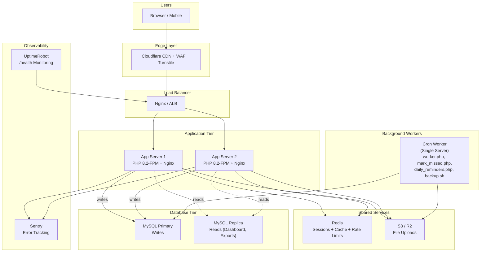

# Scaling Guide — Tech-Tians CRM Portal

This document describes the scaling readiness features built into the CRM, when to move between hosting tiers, and the target multi-server architecture.

---

## 1. Stateless Application Design

The CRM is designed to be horizontally scalable. Every request can be served by any application server with zero server affinity:

| Concern | Default (Single Server) | Scaled (Multi-Server) | Config Key |
|:---|:---|:---|:---|
| **Sessions** | PHP file handler | Database or Redis | `SESSION_DRIVER=database\|redis` |
| **File Uploads** | Local disk (`storage/uploads`) | S3 / Cloudflare R2 | `STORAGE_DRIVER=s3` |
| **Cache** | Local disk (`storage/cache`) | Redis | `CACHE_DRIVER=redis` |
| **Rate Limits** | MySQL `rate_limits` table | Redis (shared) | `RATE_LIMIT_DRIVER=redis` |
| **Job Queue** | MySQL `jobs` table | MySQL `jobs` table (shared) | Cron-driven |
| **Database Reads** | Primary MySQL | Read replica | `DB_READ_HOST` |

**Key rule**: No local state that isn't also in the database or a shared store. Once `SESSION_DRIVER`, `STORAGE_DRIVER`, and `CACHE_DRIVER` point to shared services, adding app servers behind a load balancer is a config change.

---

## 2. When to Scale

### Stage 1: Shared Hosting → VPS
**Trigger signals:**
- Response times consistently > 2 seconds under normal load.
- Cron jobs (worker, reminders) delayed by shared hosting resource limits.
- Need for SSH access, custom PHP-FPM tuning, or Redis.
- Hosting provider rate-limits outbound SMTP.

**Action**: Move to a single VPS (2 vCPU, 4GB RAM). See `docs/deployment.md` Option B.

### Stage 2: Single VPS → VPS + Managed MySQL
**Trigger signals:**
- Database CPU consistently > 70% during business hours.
- Slow queries despite indexes (check `EXPLAIN` results).
- Need for automated backups, point-in-time recovery.

**Action**:
1. Migrate MySQL to a managed database (AWS RDS, DigitalOcean Managed MySQL, PlanetScale).
2. Update `DB_HOST` to the managed instance endpoint.
3. Optional: Set `DB_READ_HOST` to a read replica for dashboard/export queries.

### Stage 3: Single App Server → Load Balanced
**Trigger signals:**
- PHP-FPM worker pool saturated (`pm.max_children` reached) under peak load.
- Need for zero-downtime deploys without maintenance windows.
- > 500 concurrent users or > 50 requests/second sustained.

**Action**:
1. Switch all shared state to external services:
   ```ini
   SESSION_DRIVER=redis
   CACHE_DRIVER=redis
   RATE_LIMIT_DRIVER=redis
   STORAGE_DRIVER=s3
   ```
2. Add a second app server behind a load balancer (Nginx, HAProxy, or cloud LB).
3. Point cron jobs to run on **one** designated server only (or use a leader-election lock row).

### Stage 4: Full Production Architecture
**Trigger signals:**
- > 100 staff users, > 50,000 clients.
- SLA requirements (99.9% uptime), compliance audits.

See the architecture diagram below.

---

## 3. Target Architecture



---

## 4. Component Details

### 4.1 Session Handler (`SESSION_DRIVER`)

| Driver | Config | When to Use |
|:---|:---|:---|
| `files` | Default, zero setup | Single server, shared hosting |
| `database` | Needs `sessions` table (migration 014) | Multi-server without Redis |
| `redis` | Needs `REDIS_HOST`, `REDIS_PORT` | Multi-server with Redis |

### 4.2 File Storage (`STORAGE_DRIVER`)

| Driver | Config | When to Use |
|:---|:---|:---|
| `local` | Default, files in `storage/uploads/` | Single server |
| `s3` | `S3_BUCKET`, `S3_KEY`, `S3_SECRET`, optional `S3_ENDPOINT` for R2 | Multi-server, or offload disk I/O |

To migrate existing local files to S3:
```bash
# Using AWS CLI (works for R2 with --endpoint-url)
aws s3 sync storage/uploads/ s3://my-bucket/uploads/ --endpoint-url=https://acct.r2.cloudflarestorage.com
```

### 4.3 Job Queue

- **Table**: `jobs` (migration 014).
- **Worker**: `cron/worker.php` — cron every minute, processes up to 20 jobs per run.
- **Dispatch from code**: `(new JobQueue())->dispatch('App\Services\MailService::sendPasswordReset', ['email' => $e, 'link' => $l], 'email')`.
- **Retry**: Exponential backoff (30s, 60s, 120s). Max 3 attempts. Failed jobs stay in table for inspection.
- **Scaling**: For higher throughput, run multiple cron instances or switch to a Supervisor-managed daemon.

### 4.4 Read Replica (`DB_READ_HOST`)

When configured, `Database::getReadConnection()` returns a separate PDO instance connected to the replica. Use it in read-heavy services (dashboard stats, exports, reports). Falls back to the primary connection when `DB_READ_HOST` is empty.

```php
// In DashboardService or export queries:
$readPdo = Database::getReadConnection();
$stmt = $readPdo->prepare('SELECT ... heavy aggregate ...');
```

---

## 5. Capacity Planning Reference

| Component | Single VPS (4GB) | Scaled (2× App + Managed DB) |
|:---|:---|:---|
| Concurrent users | ~100–200 | ~500–1000+ |
| Clients in database | ~50,000 | ~500,000+ |
| Requests/second | ~30–50 | ~150–300+ |
| File storage | 20–50 GB local disk | Unlimited (S3/R2) |
| Database size | 1–5 GB | Managed, auto-scaling |

---

## 6. Migration Checklist: Single Server → Multi-Server

1. ☐ Provision Redis instance (managed or self-hosted).
2. ☐ Set `SESSION_DRIVER=redis`, `CACHE_DRIVER=redis`, `RATE_LIMIT_DRIVER=redis` in `.env`.
3. ☐ Provision S3/R2 bucket. Set `STORAGE_DRIVER=s3` with credentials in `.env`.
4. ☐ Sync existing uploads: `aws s3 sync storage/uploads/ s3://bucket/uploads/`.
5. ☐ Provision managed MySQL. Update `DB_HOST`. Optional: `DB_READ_HOST` for replica.
6. ☐ Provision second app server. Clone release deployment.
7. ☐ Configure load balancer (Nginx upstream, ALB, etc.) pointing to both app servers.
8. ☐ Ensure cron jobs run on **one** server only (designate a "cron leader").
9. ☐ Verify `/health` returns 200 from both app servers through the load balancer.
10. ☐ Update DNS to point to the load balancer.
